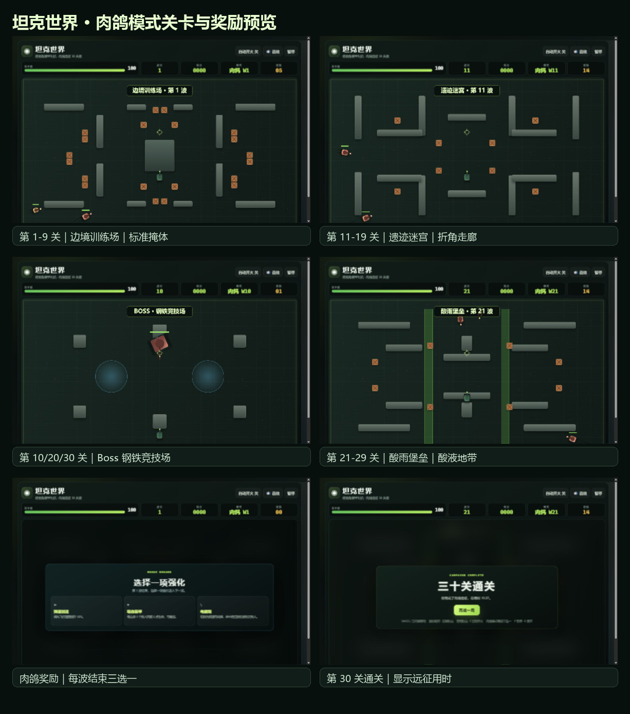

# 坦克世界：肉鸽远征

一个无需安装、无需构建、打开浏览器即可游玩的俯视角坦克生存游戏。

## 游戏模式

- **普通模式**：标准规则，属性固定。
- **增益模式**：每次击杀提升射速、弹丸数、攻击力、生命上限和回血量。
- **肉鸽模式**：每波结束三选一强化，第 10/20/30 波为 Boss，第 30 波通关并显示用时。

## 肉鸽特色

- 电磁炮：高速弹丸、连锁伤害并减速敌人。
- 喷火器：短距离、高射速、高持续伤害。
- 穿墙弹、贯穿弹、并列炮管、吸血装甲等强化。
- 1-9 关标准训练场，11-19 关遗迹迷宫，21-29 关酸雨堡垒。
- Boss 竞技场包含立柱和冷却减速区域。
- 酸雨堡垒包含持续伤害与减速的酸液地带。
- 移动端支持横屏双摇杆操作。

## 操作

- `WASD` / 方向键：移动
- 鼠标：瞄准
- 鼠标左键 / 空格：开火
- `F`：切换自动开火
- `P`：暂停
- `R`：重新开始
- 右上角“退出模式”：结束当前进度并返回模式选择

手机端横屏时使用左右虚拟摇杆：左侧移动，右侧瞄准并自动开火。右上角“横屏全屏”按钮可请求全屏，并在浏览器支持时尝试锁定横屏。

## 运行

直接双击 `index.html`，或用任意静态文件服务器打开。项目不依赖外部 CDN、第三方库或构建步骤。

## 预览



## 项目结构

```text
坦克世界_肉鸽远征/
├─ index.html
├─ README.md
├─ source/
│  └─ 坦克世界_v8.html
└─ screenshots/
```

`source/` 保留打包前的单文件原始版本。


